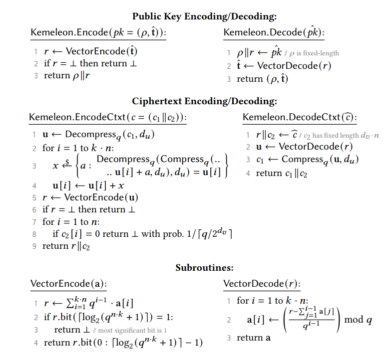

# Kemeleon

Algorithms for Obfuscating ML-KEM handshake materials.

## Why?

This library implements obfuscating encoding schemes for ML-KEM encapsulation
keys and ciphertext messages such that they are computationally indistinguishable
from random by a passive observer.

**Why aren't the NTT encodings from the FIPS spec (`ByteEncode_d(F)`, `ByteDecode_d(B)`, etc.) sufficient?**

The wire format of the encapsulation key is trivially distinguishable from uniform
random becuase they values are 12 bit values where all are computed mod Q. Thus
all values are 12 bits, but always less than 3329.

---

## Kemeleon Spec

  

---

## Roadmap

Core features

- [x] Public interface first pass
- [x] Interface with [`ml_kem`](https://docs.rs/ml-kem/latest)
- [x] Implement complete Encapsulation Key encoding / decoding
- [x] Implement and test ciphertext encoding / decoding
- [ ] Nist vectors Integration tests
- [ ] Ciphertext encoding determinism using hkdf, hmac-drbg, or something similar
- [ ] Pass on public docs

Cleanup

- [ ] GH actions for testing, building, linting, etc.
- [ ] Modify implementation to be `no-std` compatible
- [ ] Move const generics (`#![feature(generics_const_exprs)]`) to its own branch
  - const generics are an unstable feature, even though this is a very simple
application of the feature it is bad practice to ask people use it in its current state.
- [ ] Use [`generic_array`](https://docs.rs/generic-array/latest/generic_array/) for
all type based generics requiring sized arrays
- [ ] Polish interface and docs for first release
- [ ] Github actions release workflow

