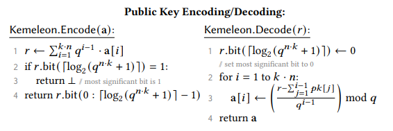
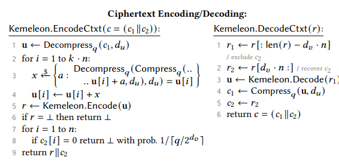

# Kemeleon

Algorithms for Obfuscating ML-KEM handshake materials.

## Why?

This library implements obfuscating encoding schemes for ML-KEM encapsulation
keys and ciphertext messages such that they are computationally indistinguishable
from random by a passive observer.

**Why aren't the NTT encodings from the FIPS spec (`ByteEncode_d(F)`, `ByteDecode_d(B)`, etc.) sufficient?**

The wire format of the encapsulation key is trivially distinguishable from uniform
random becuase they values are 12 bit values where all are computed mod Q. Thus
all values are 12 bits, but always less than 3329.

---

## Kemeleon Spec

---

## Roadmap

Core features

- [x] Public interface first pass
- [x] Interface with [`ml_kem`](https://docs.rs/ml-kem/latest)
- [ ] Implement complete Encapsulation Key encoding / decoding
- [ ] Implement and test ciphertext encoding / decoding
- [ ] Pass on public docs

Cleanup

- [ ] Modify implementation to be `no-std` compatible
- [ ] GH actions for testing, building, linting, etc.
- [ ] Move const generics (`#![feature(generics_const_exprs)]`) to its own branch
  - const generics are an unstable feature, even though this is a very simple
application of the feature it is bad practice to ask people use it in its current state.
- [ ] Use [`generic_array`](https://docs.rs/generic-array/latest/generic_array/) for
all type based generics requiring sized arrays
- [ ] Polish interface and docs for first release

---

## Ideal Features

- Deterministically generated
  - i.e. empty bits cannot just be filled with randomness that is not tracked
  because if we need to use the wire format of the key in a future hash or
  transaction then we need to deterministically regenerate it.

- indistinguishable from random via:
  - frequency analysis
  - entropy analysis
  - computational transformation (followed by the above techniques^)

- the algorithms for encoding and decoding the encapsulation key are publicly available

- Do not interfere with the distribution of the values of the encapsulation key
which need to be uniformly distributed over the field itself.

- [_Encoding_] The values of the encapsulation key are fixed ahead of time based on the chosen
secret decapsulation key.

- [_Hash2Curve_] \(not sure this even makes sense for ML-KEM schemes, but) creating an encapsulation
key based on a hashed value may use a different algorithm than the "`decoding`"
