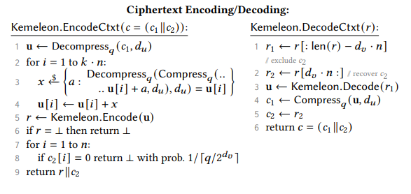

# Randomizing Kyber Key Encoding

Workspace for testing out different ways of encoding Kyber encapsulation keys such that
they are computationally indistinguishable from random by an observer.

**Why aren't the NTT encodings from the FIPS spec (`ByteEncode_d(F)` and `4 ByteDecode_d(B)`) sufficient?**

The wire format of the encapsulation key is trivially distinguishable from uniform
random becuase they values are 12 bit values where all are computed mod Q. Thus
all values are 12 bits, but always less than 3329.

---

## Ideal Features

- Deterministically generated
  - i.e. empty bits cannot just be filled with randomness that is not tracked
  because if we need to use the wire format of the key in a future hash or
  transaction then we need to deterministically regenerate it.

- indistinguishable from random via:
  - frequency analysis
  - entropy analysis
  - computational transformation (followed by the above techniques^)

- the algorithms for encoding and decoding the encapsulation key are publicly available

- Do not interfere with the distribution of the values of the encapsulation key
which need to be uniformly distributed over the field itself.

- [_Encoding_] The values of the encapsulation key are fixed ahead of time based on the chosen
secret decapsulation key.

- [_Hash2Curve_] \(not sure this even makes sense for ML-KEM schemes, but) creating an encapsulation
key based on a hashed value may use a different algorithm than the "`decoding`"

## Kemeleon

