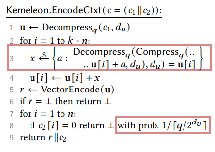

# Implementation Specifics

Discussion of implementation specifics not included in the paper.

## Iterative Key Generation

As both the `generate()` and `Ciphertext.Encode()` reject with reasonably frequent probability we implement
the key generation and shared secret encapsulation to be iterative. This way, if the provided source of
randomness is reliable, values that satisfy the sampling criteria will be chosen with near certainty.

TODO: this section is incomplete

## High Order Bits, Randomness, and Key Encodings

The kemeleon representation of the encapsulation key requires several bits of of randomness (beyond the 
value of the key itself). This is because the kemeleon encoding is uniform random to a number of bits which
is not divisible by 8. If we do not generate these deterministically, then there is no longer a one-to-one
mapping of encapsulation key representations to decapsulation keys. As there is no change to the serialized
format of the decapsulation key, if an application required that their long term identity key were kemeleon
encodable serializing on exit and deserializing on startup, drawing the high order bits from random would
(likely) result in differing kemeleon representations of the encapsulation key.

In order to avoid this issue, the extra byte of randomness is deterministically drawn from an HKDF of the
FIPS byte representation of the decapsulation Key. This reveals nothing about the value of the chosen
decapsulation key as the following resists preimage and second preimage attacks.

$$
HKDF_{sha256}(ikm:":constant\_string", info: dk.as\_bytes(), salt: NULL)
$$

In this way the kemeleon representation of the encapsulation key is made one-to-one with the decapsulation
key as there is only one valid value for the high order bits.

### Avoiding Bit Manipulation

It is important to note that decoding the kemeleon encapsulation key clears the high order bits, meaning that
they do not actaully impact the correctness of the decoded key. When including a kemeleon encoded encapsulation
key in a message sent through a potentially adversarial channel it is important to ensure that the byte
representation has not been tampered with (using something like an HMAC) to avoid an attack where the adversary
flips one or more of the high order bits without the application throwing an error.

## Ciphertext Encoding

### Randomness Management

The Kemeleon algorithm for encoding an ML-KEM ciphertext relies on randomness in two places - steps 3 and 8 in the figure
below. However if we use a good source of randomness this leads to the following undesirable properties.

1. For a single ciphertext, each call encode results in a different encoded value.

2. For a single ciphertext, determining whether we reject or accept the encoding is dependent on the values sampled from
the source of randomness. So subsequent calls to encode may either reject or accept with no consistency.

In order to prevent these properties we require a secure deterministic source of random bytes. We construct our
deterministic source of randomness using an HKDF over the FIPS representation of the ciphertext and the associated
shared secret. This expanded secret, unique to the created handshake, creates a deterministic set of bytes that can only
be generated by the participating members of the ML-KEM handshake. Our encoding now 1) is encoded to the same value
every time it is encoded and 2) will _always_ be accepted or rejected on subsequent calls to encode.



#### How many random bytes are required?

In order to answer this we have to give slightly more detail about how the algorithms use random values.

**In steps 2-4** we iterate over the $K \times N$ values in the `U` element of the ciphertext and "recover"
randomness.

> To address the non-uniformity in c1, we decompress c1 and then “recover” randomness by adding random values within a
> designated range. After reintroducing randomness, we have coefficients that are uniformly distributed modulo 𝑞, which
> brings us to the same setting as with public keys. (Section 2.4 - Ciphertexts)

We do this using a pre-computed map of the domain to co-domain for the compress function (see
[Pre-computed Equivalence Sets](#pre-computed-equivalence-sets)). This allows us to get the set of all values that
map to the same value when compressed. We now need to choose one of these elements at random to find a value `a` that satisfies the equivalence below for each value in `U`.
$$
u[i] \xleftarrow \$ \{ a: Compress(a, d_u)=Compress(u[i], d_u) \}
$$

In theory if you compressed the values to use a single bit you would have just two equivalence sets, both of size $\cong
Q/2$. As it requires 12 bits to represent $Q$ (and 11 to represent $Q/2$), we _could_ need a value larger than 256 (i.e
more than one byte) to properly index into the equivalence set. Meaning that for each of the $K \ times N$ values in the
`U` element of the ciphertext we require two bytes from our source of randomness.

$$
2 \times K \times N \text{ in total for this step.}
$$


**In steps 7-8** we iterate over the `N` values in the `V` element of the ciphertext and reject conditionally if both
the $i^{th}$ value is equal to 0 AND our we sample values between 0 and `Q` and the value is below $2^{d_v}$.
Given that 2 bytes is enough for a value in $[0,Q]$, we need $N \times 2$ bytes of randomness.
An example implementation looks like:

```rust
fn rejection_sample<R: CryptoRng + RngCore>(c2: &[u16; 256], rng: &mut R, dv: usize) -> bool {
    let lim = 2_u16.pow(dv as u32);
    let mut b = [0u8; 2];
    for val in c2 {
        rng.fill_bytes(&mut b);
        let y = u16::from_be_bytes(b);
        if val == 0 && y % 3329 < lim {
            return false;
        }
    }
    true
}
```

While we could wait until we detect an element with value equal to 0 before sampling the random number generator
this could lead to a timing correlation based on the number of `0s` in the V element. So instead we sample
the random source for all `N` values, failing fast if we find that this round the chosen value is not encodable.

**TLDR: In total we require:**

$$
K \times N \times 2 + N \times 2 = 2N(K + 1)
$$

$$
512 => (N:256, K:2) => 1536 \text{ B} \newline
$$

$$
768 => (N:256, K:3) => 2048 \text{ B} \newline
$$

$$
1024 => (N:256, K:4) => 2560 \text{ B}
$$

### Pre-computed Equivalence Sets

To prevent repeated derivation of the domain and co-domain mapping of the compress function We pre-compute
the mapping for $D_v$ values 4 and 5.

TODO: this section is incomplete
